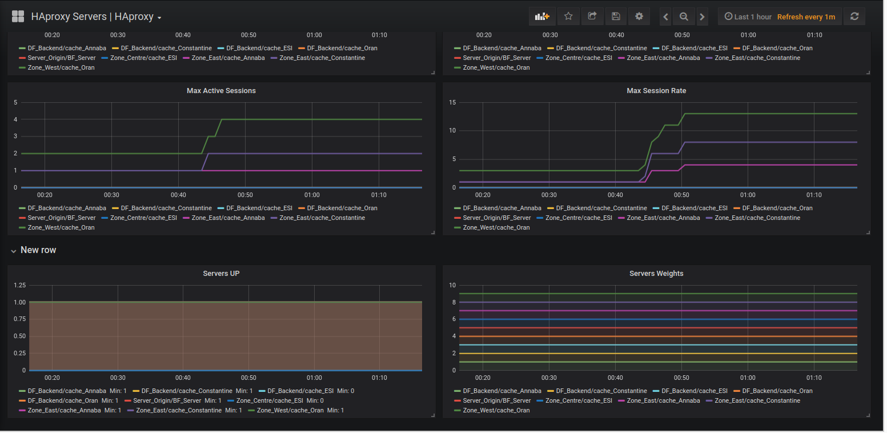
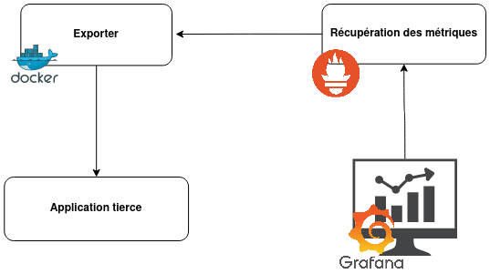

# OpenCDN Monitoring Server

This repository contains the setup instructions for a monitoring server using [Prometheus](https://prometheus.io/) and [Grafana](https://grafana.com/). The monitoring server allows you to collect and visualize metrics from various servers and services.
<p align="center">
  
</p>


## Prerequisites
Before setting up the monitoring server, ensure that you have the following prerequisites:

- Docker: Make sure Docker is installed on your system.

## Setup Instructions

1. Create a network to allow communication between Grafana and Prometheus:
```shell
   docker network create grafana_prom
```
2. Launch the Prometheus container and mount the configuration file:
```shell
docker run -d -p 9090:9090
-v /home/monitoring/Desktop/prometheus.yml:/etc/prometheus/prometheus.yml
--name prometheus
--network grafana_prom
prom/prometheus
```
The Prometheus configuration file can be found [here](./prometheus.yml).

3. Launch the Grafana server, enabling it to communicate with Prometheus within the same network:
```shell
docker run -d -p 3000:3000
--name grafana
--network grafana_prom
grafana/grafana
```

4. Access Grafana by navigating to `http://localhost:3000` in your web browser and login using the default credentials:
- Username: admin
- Password: admin

5. Once Grafana is connected to Prometheus, you can add Prometheus as a data source. 

6. To import the predefined dashboards, select the desired JSON files and add them to Grafana's interface. In this case, we have selected two dashboards: [one for Haproxy](https://grafana.com/grafana/dashboards/367-haproxy-servers-haproxy/) and [another for metrics on other servers](https://grafana.com/grafana/dashboards/11074-node-exporter-for-prometheus-dashboard-en-v20201010/). These dashboards can be found in Grafana lab dashboards.

## Architecture
<p align="center">
  
</p>

The image above illustrates the architecture of the monitoring server, showing how Prometheus collects metrics from various servers and services, and Grafana visualizes the data.

## Additional Notes
- Make sure to customize the Prometheus configuration file `prometheus.yml` according to your specific monitoring requirements.

- Explore Grafana's documentation and available plugins to enhance your monitoring experience.

- Feel free to contribute to this repository by submitting improvements or additional dashboards.

Happy monitoring! 🚀
