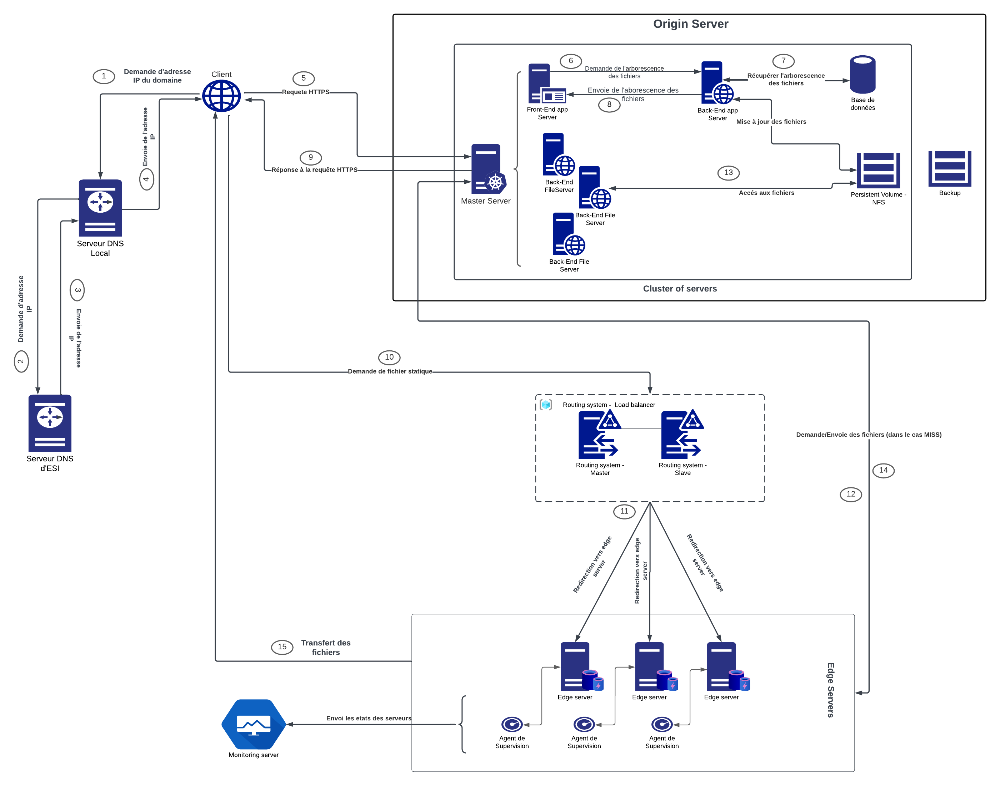

# CDN Project

This repository contains the implementation of a CDN and applying it for course development for Algerian universities.  

## Architecture 
This figure showcases the general architecture of our CDN solution:  

## Components

- **Origin Server**: The origin server is one of the key elements of any CDN system, and is responsible for storing all files and transmitting them to the edge servers in response to requests.
files and forwarding them to the edge servers in response to requests. It also serves
user interface. Given its importance, we've made sure it's scalable,
highly available and have a fast response time.
    - *Application servers*: the user interface the customer will use.  
    - *Backend file server*: The server responsible for storing and delivering content.  
    - *Kubernetes*: For our storage solution, we decided to use the persistent volume functionality
provided by Kubernetes to manage the storage needs of our containerized applications.
applications. This feature enables us to easily provision and manage sto-
ckage resources, ensuring that our applications have access to persistent data even if a container
container fails or is rescheduled on a different node.  
To implement this storage solution, we decided to use NFS (Network File
System), which offers a reliable and scalable option for sharing data between containers and
nodes. Given that we'll have multiple services accessing the same storage over the network,
NFS offers a practical and efficient option for our needs.
By using Kubernetes' persistent volume feature and NFS as our storage backend,
we can ensure that our applications have reliable access to persistent data, which ultimately
ultimately improves the availability and reliability of our services.

- **Edges servers**: These are the servers
with which the client will interface to obtain the desired files.
to minimize latency and provide faster response times.
After carefully evaluating different caching solutions for our CDN, we decided to use Nginx as our preferred caching solution.
decided to use Nginx as our edge server and caching solution. Nginx is a powerful
sant web server and reverse proxy server that offers several advantages for caching
content
- **Routing system**: The routing system's mission is to redirect a user to an Edge server when he or she
educational content. The routing strategy defines how this redirection takes place and on what criteria.
and on what criteria it is based. It plays a very important role in a CDN, as it is this strategy that
that ensures that a user is redirected to the Edge server that will respond as quickly
possible.
For our CDN, we've opted for the HTTP Redirection mechanism, whereby users' HTTP requests
requests are directed to the Proxy server (Routing System), which will redirect them
to one of the Edge servers, depending on the routing strategy we've set up.
We opted for the HAProxy tool to set up our CDN's routing system (proxy server).
This tool offers excellent performance and is very easy to configure.
load-balancing algorithms, including the Least Connection algorithm we plan to use.
We'll also be using this tool's Health Check function to enable the proxy server to know the status of each
the status of each Edge server. This function is based on the periodic sending of HTTP
HTTP requests to edge servers and listens to their responses to conclude whether a server is operating
normally or not
- **DNS**: Although our CDN doesn't rely on the DNS mechanism for query redirection, it's still important to set up a DNS server. a DNS server is nonetheless important. This will be a classic DNS server, allowing the server, enabling resolution of the front-end app server name so that customers can access the application. We'll be using the Bind tool to set it up. allows you to set up a DNS server quickly and easily.  
- **Monitoring system**: The monitoring system plays an important role in a CDN, even if it is not directly involved in its operation.
in its operation. We opted for two tools, Promotheus and Grafana, which are easy to install and offer excellent performance.
the former will handle communication with the various agents (known as exporters).
agents (known as exporters) for data collection, while Grafana will enable us to set up comprehensive
dashboards to visualize the various data collected.

## Conclusion 

In conclusion, the CDN project for course development in Algerian universities is designed to improve the delivery of educational content by implementing a comprehensive CDN solution. The architecture consists of various components and by utilizing them, we aim to enhance availability, reliability, and performance in delivering educational resources.